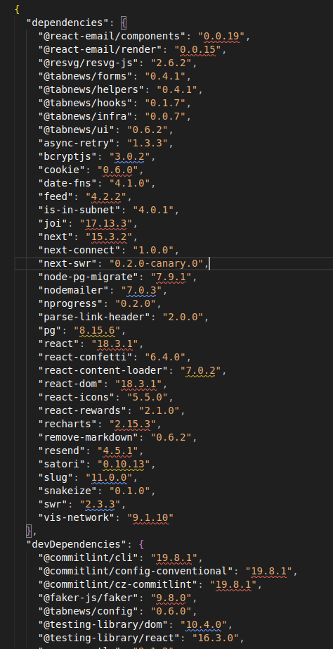
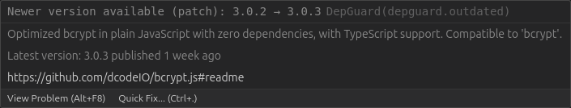
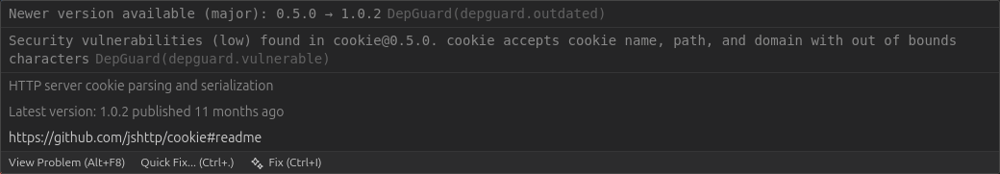
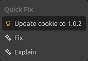

# 🚨 DepGuard

## _Your VS Code watchdog for outdated & vulnerable npm dependencies._

<div align="left">

**DepGuard** automatically monitors your project’s dependencies — in real time — detecting:

- ⚡ Outdated versions (major/minor/patch)
- 🔐 Security vulnerabilities (via npm Advisory DB)
- 🎨 Inline color-coded diagnostics
- 🛠️ Quick Fix to update dependencies instantly
- 🚀 Background scanning and caching

</div>

## 📦 Features

### Outdated dependency detection

DepGuard checks every dependency listed in:

- `dependencies`
- `devDependencies`

And flags updates using semantic version diff:

| Update type | Example         | Severity color |
|-------------|-----------------|----------------|
| **Major**   | `1.x → 2.x`     | 🔴 Error       |
| **Minor**   | `1.2 → 1.3`     | 🟡 Warning     |
| **Patch**   | `1.2.3 → 1.2.4` | 🔵 Info        |

### Security vulnerability alerts (npm advisories)

DepGuard warns you _right inside_ your `package.json`:

- Advisory severity (low / moderate / high / critical)
- Advisory titles
- Patched versions
- Links to the GitHub advisory

### Quick Fix: Update dependency with one click

Hover → Fix → Done ✨

```jsonc
"cookie": "0.5.0"
// Quick Fix: Update to "^1.0.2"
```

DepGuard respects the prefix:

- `^`
- `~`
- Exact version

### Smart caching (no rate limit drama)

DepGuard caches:

- Latest versions
- Vulnerability results
- Workspace-wide prewarm cache

This keeps everything fast even in huge monorepos.

### Background scanning every 30 minutes

DepGuard keeps monitoring silently, refreshing:

- Version cache
- Vulnerability data
- Diagnostics across all open editors

### Ignored locations

By design, DepGuard **never** scans:

- `node_modules/`
- `.pnpm/`
- `.yarn/`

Even if you open those package.json files manually.

## Screenshots





### Showing security feature



### Showing a quick fix



## Installation

### From VS Code Marketplace

[Visual Studio Marketplace](https://marketplace.visualstudio.com/items?itemName=harukadev.depguard)

### From VSIX locally

```bash
code --install-extension depguard-1.0.0.vsix
```

## Settings (coming next)

| Setting                       | Description                                 | Default |
|-------------------------------|---------------------------------------------|---------|
| `depguard.security.enabled`   | Enables/disables security advisory scanning | `true`  |
| `depguard.backgroundInterval` | Time between automatic rescans              | `30min` |
| `depguard.ignore`             | Packages to ignore                          | `[]`    |

## Commands

### `DepGuard: Scan current package.json`

Useful when you disable automatic scanning or want to quickly refresh results.

## Project Structure

```shell
src
│
├── extension.ts                # Entry point
├── activity.ts                 # Status bar + request counter
├── npmClient.ts                # NPM API calls + caching
├── semverUtils.ts              # Version diff & semver logic
├── diagnostics.ts              # Main scanner + diagnostics
├── codeActions.ts              # Quick Fix provider
└── workspace.ts                # Workspace prewarm
```

## 🤝 Contributing

PRs, issues, and suggestions are super welcome!

If you want to contribute:

```bash
npm install
npm run watch
# Press F5 to open Extension Development Host
```

## 🧪 Testing

```bash
npm test
```

## 📅 Roadmap

- [ ] “Update All Safe Dependencies” (patch+minor only)
- [ ] Settings UI
- [ ] Ignore specific advisories
- [ ] Sidebar with a dependency health report
- [ ] pnpm/yarn lockfile integration
- [ ] Version drift detection across monorepos

## 🛡 License

Distributed under the **MIT License**.
See [`LICENSE`](./LICENSE) for details.
